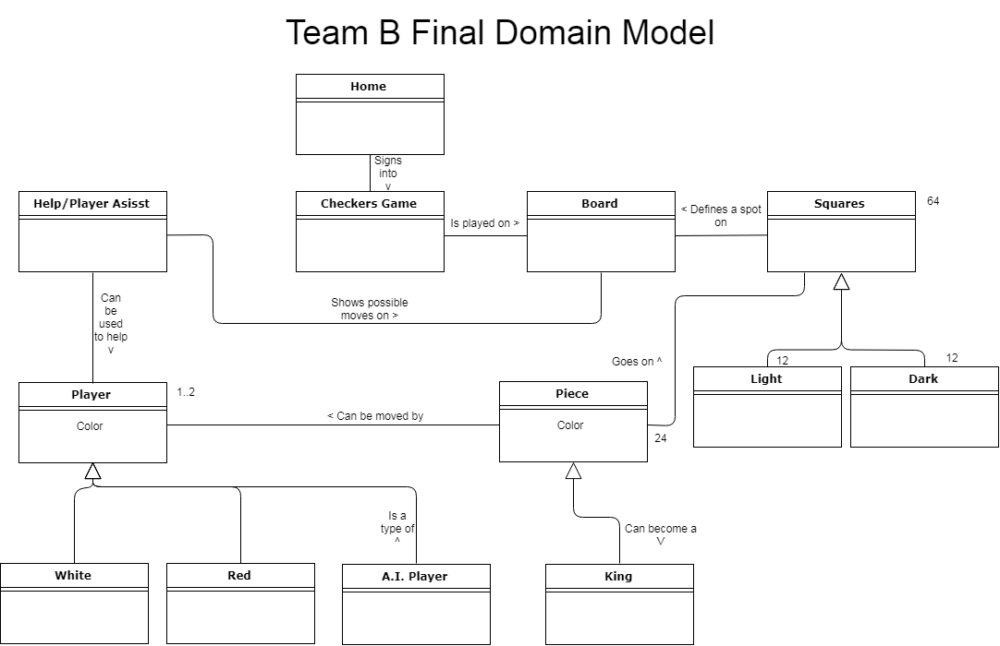
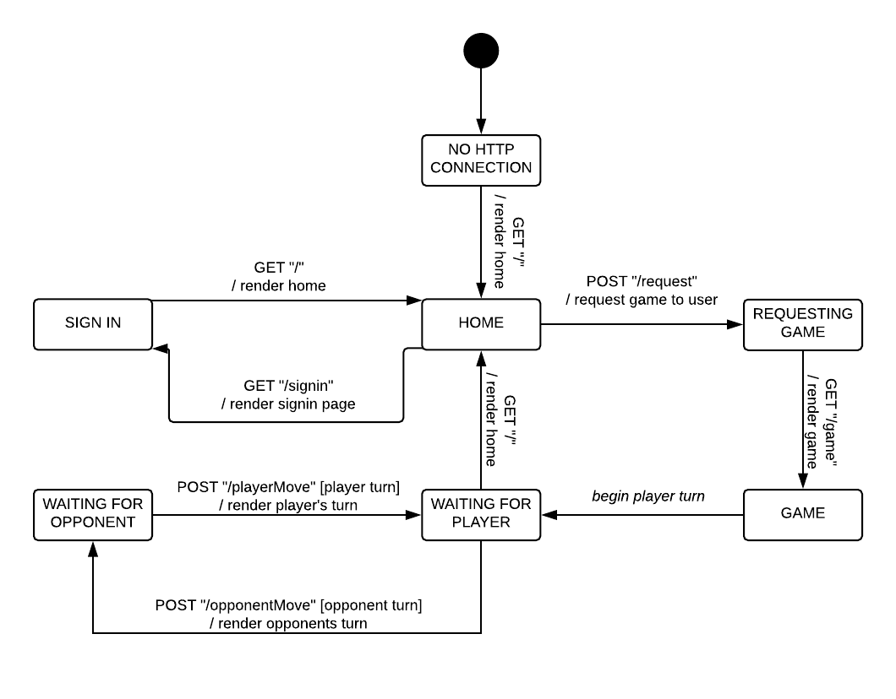

# PROJECT Design Documentation

## Team Information
* Team name: 08B
* Team members
  * Chris Abajian
  * Andy Zhu
  * Kevin Adrian
  * Fayez Mehdad
  * Rebecca Reich

## Executive Summary

This project creates a web version of checkers played by 2 players using the American rules for checkers.

### Purpose
This project aims to create an interactive web based game for the product owner, including a few game enhancements to
make the game more enjoyable. The most important user group in players on the web and the project aims to provide a easy
to play drag and drop UI experience to the classical checkers game.

### Glossary and Acronyms

| Term | Definition |
|------|------------|
| VO | Value Object |
| MVP | Minimum Viable Product |
| UI | User-Interface |

## Requirements

This application allows multiple people to be signed into the lobby and start a game with each
other by clicking on the names in the player lobby. Once the game screen comes up, the two players are
then prompted to play the game with each other using the American rules for checkers.

### Definition of MVP
The Minimum Viable Product of a project is the bare minimum Epics and Stories that needs to be develops to have the
project running, and it is the minimum amount of deliverable for the software to the developer. The additional features
are only developed after gathering initial feedback based on the MVP.

### MVP Features
The following is the list of features consider to be the MVP for this project:
1. Players must be able to sign into the player lobby before a game begins and must be able to sign out after the
game is over
2. The two players, when signed can, can engage in a game of checkers with one another based on the American rules.
3. At any point either player may choose to resign from the game, which would bring an end to the game.

### Roadmap of Enhancements
Following, in chronological order, is the roadmap of enhancements to this projects:
1. Create a help button, that allows the player playing to see the possible moves that he can make
at any given time with the selected piece.
2. Create an AI player so that any player can choose to play a single player game of checkers and gather
practice.

## Application Domain

This section describes the application domain.

The Checkers Game is played by 2 players on a Board, consisting of Light and Dark Squares. The squares may or may not contain pieces, that belong to either player. The player can be White, Red or an A.I.

## Architecture and Design

This section describes the application architecture.

### Summary

The following Tiers/Layers model shows a high-level view of the webapp's architecture.

As a web application, the user interacts with the system using a
browser.  The client-side of the UI is composed of HTML pages with
some minimal CSS for styling the page.  There is also some JavaScript
that has been provided to the team by the architect.

The server-side tiers include the UI Tier that is composed of UI Controllers and Views.
Controllers are built using the Spark framework and View are built using the FreeMarker framework.  The Application and Model tiers are built using plain-old Java objects (POJOs).

Details of the components within these tiers are supplied below.

### Overview of User Interface

This section describes the web interface flow; this is how the user views and interacts
with the WebCheckers application.

The web application renders the home for the user. The User is then asked to sign in. Signing in brings the
user back to the Home. From this stage the user can Request a game, given that there is another player online, and
this will render a game for the user. The game begins with the game waiting for the player to make a move, and
then waits for the opponent to make a move, and this repeats until there is a winner or one of the players
quit the game.

### UI Tier
When the program is launched, WebServer is created. It initializes the set of HTTP request handlers. The WebServer
creates two objects, a TemplateEngine object and a Gson object. All UI routes are passed either one of or both of these
 objects in order create a view or to return a json object to an ajax call. `GET /Home` route is called to display the
 home page using `home.ftl`. It uses a hashmap of objects with the templateEngine
passed by the WebServer in order to create the view and model for the home page. The player then will have the option
of signing into the system. Signing in calls the `GET /Signin` route. This route renders the singin page and lets the player
input a name into an input box. Inputting an username calls the `POST /Signin` route, which will delegate the responsibility
of checking the validity of the username and adding the player into a list of players to the PlayerLobby object.
If the PlayerLobby determines that the username is valid, then a player object for the username is returned to the
Signin route, which makes the route redirect the user back to the home page. Otherwise `POST /Signin` uses the
templateEngine to display an error on the signin page and re-renders that page, telling the user that their username was
invalid.

When the user is redirected back to the home page with their username, they have the choice to sign out their username.
This will evoke the `GET/ Signout` route. All this does is make the PlayerLobby remove that player from this list of logged
on players and invalidate their current session. This is so that all objects bounded to that session are cleared. The
signout route then puts a Message into a hashmap for the templateEngine to render into the home page, telling the user
that they have signed out.

When the user is still signed on and there is another player in the list of players, both are displayed by the home
page. A user can click on a username other than his. Doing so triggers the `POST /Request` route. The route checks if the
opponent player is in game and acts accordingly. If player is in the game, the user is redirected back to the home page
with an Message object displaying an error that the selected opponent is currently in a game. If the opponent is not
in a game, then `POST /Request` creates a new CheckersGame and puts it into the http session, sets the player and their
opponent into a newly created CheckersGame, locks them into the game, and loads both players into the game page using
GetGameRoute.

When GetGameRoute is invoked, it loads the game page using `game.ftl`. GetGameRoute retrieves the CheckersGame object that
both players share. It then uses the templateEngine from the WebServer to render a view using `game.ftl` and Freemarker
variables. From there, the red player is set to an EmptyTurn state while the white player is set to the WaitingForMyTurn
state, using the getWhoseTurn method.

In order to move a piece, they have to be dragged and dropped. The `POST /ValidateMove` route handles single moves, jump
moves, and multiple jump moves and brings the player to the ValidatingMove state. As of now, this route does not
delegate the validation of moves to any controller object, but instead, it checks the moves itself. This will be
corrected and the design document will be updated to show this. After checking that a move is valid, it returns a
Message object for the ajax call, denoting that the move was valid and letting the move process successfully. The
player would then enter the StableTurn state. This is the same process for all three types of movements. If an opponent's
piece was jumped over, the ValidateMove route would delegate the removal of that piece to the Gameboard object.

From the StableTurn state, if the player had previously made a jump, the player must make additional jumps if possible.
The process of invoking the `POST / ValidateMove` is repeated, moving the player from the StableTurn state back to the
ValidatingMove state and back again.

Alternatively, after performing a move, the player can choose to undo the move by using the "Backup" button. Doing so
causes an Ajax call that invokes the `POST /BackupMove` route. This brings the player to the RequestingBackupMove state. The
route handles backing up of a piece using program flow statements. After the backup, if the player still has previous
moves, they are moved back to the StableTurn state. Otherwise, if that was their first move that had been undone, they
are returned to the EmptyTurn route.

After the player decides to finish up their move, they click the Submit Turn button. This calls the `POST /SubmitTurn`
route, which processes the turn and makes sure there are no loose ends. The player is moves to the Processing Turn state
because of this. The route returns to the Ajax call an error Message object if the player has no more moves remaining
or if they player did not finish completing their turn. Otherwise, the route returns an info Message to the Ajax call,
telling it that the turn was valid and to give the other player the next turn.

At any point of the game, if it is not the player's turn, or if the turn player has not made a move yet, they can resign
the game. This is where the `POST /ResignGame` route comes in. Simply put, the route makes the current CheckersGame end by
clearing the game connection between the players and the game session. Afterwards it has the game flag that a player
has resigned and returns a info Message telling the Ajax call that there was a resignation. Setting the resign flag
allows the GetGameRoute to stop refreshing the game page and redirect both players back to the home page via the
`Get /Home` route.

### Application Tier
The application tier of this project handles the PlayerLobby functionality and the CheckersGame
functionality. It creates one instance of the game for the two players. The playerlobby allows
the players to sign in and signout of the the game at any time. The CheckersGame class is responsible
for checking whether the game has ended, whether there is a winner or not, or else just keep the game
running.

### Model Tier
The model tier contains the majority of the backend function of the system. It contains all the
classes for the objects in the project, and has classes for the actions that take place in this game.
The model begins with constructing the board itself with spaces, rows and pieces. The model tier also
contains the classes for the Player, and the messages posted for the game. However the most functionality
for this project is contained in the Gameboard class. The Gameboard class creates 2 instances of the same
CheckersGame based on the perspective of the two different players. This method also contains the game
functionality such as losePiece, CrownKing and Jump methods.

### Design Improvements
Design improvements include moving a lot of the game functionality from the model tier and Gameboard
in general into the application tier and the CheckersGame class. In addition to that, there are a few
improvements to be made in the semantics in the CSS file, such as creating a hyperlink for player names
in the PlayerLobby and changing the color of the message for PlayerLost to Red instead of Green.

## Testing
To test out this Sprint, the Acceptance testing was done along with unit testing with a report on
code coverage.

### Acceptance Testing
All of the stories in the team's Sprint Backlog for Sprint 2 has passed the acceptance criteria tests
except for Gameboard and they have been code reviewed using pull requests on Github. A conversation was
then held on Github to resolve any question the team had on the code or the branch in general after following
the Code Review, andall conflicts were resolved before merging the code onto the master branch.
Gameboard is a relatively complicated story to implement, and the development team has the Gameboard up and running
to meet requirements for the MVP, however, the development team has plans in the future to restructure the code
in the future to simply the code and make it simpler. As a result, testing for Gameboard has been delayed until Sprint
3 to reduce redundancy.

### Unit Testing and Code Coverage
Unit Tests has been created for each different tiers, and JUnit5 testing module was used to perform
the unit tests. The results of the Code Coverage are as following. Application tier has a 100% class, method and
line coverage with the unit testing, while the model tier has >80% of code coverage for all classes except for
Gameboard. The UI tier has a 60% class coverage with the testing. With code coverage for unit testing the
development team tried to maintain 100% for as many classes as possible, and if not a minimum of 80%. For the UI
tier the coverage value selected by the team was 60%, especially since covering all of the UI tier is not as essential
to the MVP as the model and application tier.

